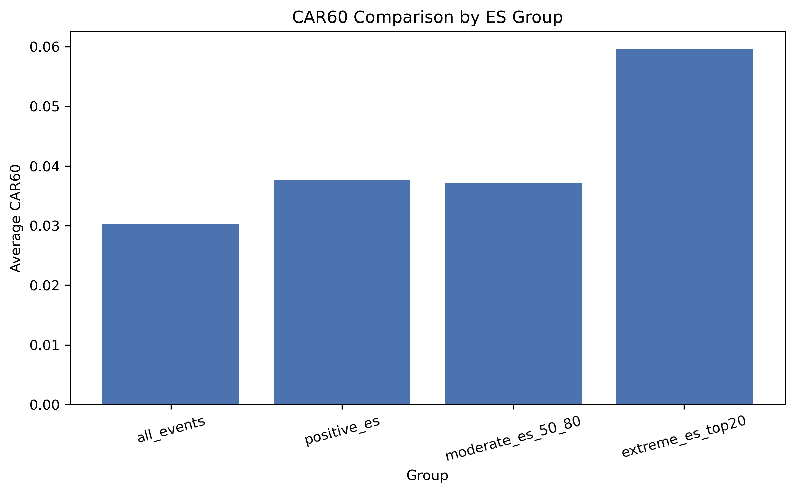
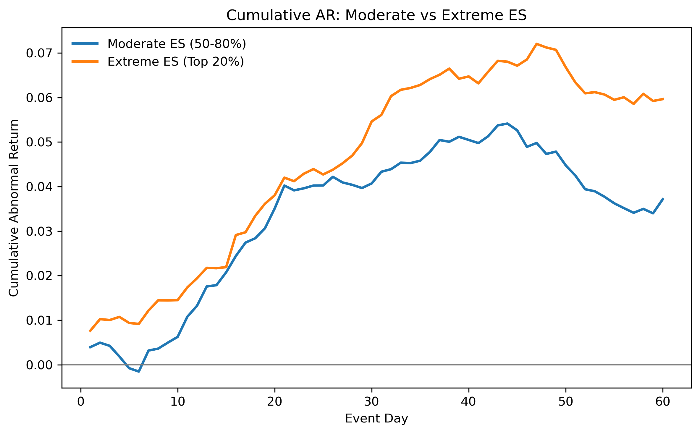
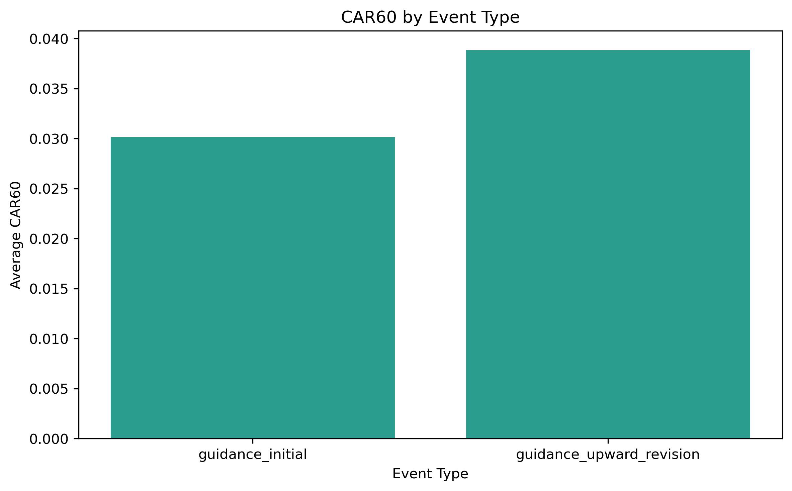

# 中国A股盈利意外、估值调整与市场有效性研究 | Earnings Surprise, Valuation, and Market Efficiency (China A-share)

<a id="zh"></a>

## 简体中文

当前语言：中文 | [Switch to English](#en)

## 项目目标

本项目研究中国A股（2020年至今）中，盈利相关事件与盈利意外信号是否对应公告后超额收益，并从公司金融视角解释其估值调整与市场有效性含义。

## 当前最终研究结论框架

最终框架是事件驱动（而非纯粹的ES单调分组）：

- 某些盈利相关事件后存在正向异常收益。
- 正向盈利意外事件平均表现优于全样本事件。
- 盈利意外幅度与CAR之间并非严格线性或单调关系。

## 样本与设计（保持不变）

- 样本区间：2020-01-01 至 2026-04-16
- 事件类型：
  - guidance_initial
  - guidance_upward_revision
- 主信号定义：
  - ES_main = guidance_yoy_midpoint - analyst_consensus_yoy_proxy
- 最终核心虚拟变量：
  - positive_ES_dummy
  - moderate_positive_ES_dummy（事件内ES>0且位于50%-80%分位）
  - high_ES_dummy（事件内前20%）
- CAR定义：
  - AR = stock_return - market_return
  - CAR20, CAR60

## 最新稳健性轮次（扩样）

本轮仅放宽样本约束，未重构ES或事件逻辑：

- 股票覆盖由 120 扩至 800
- 可用事件由 975 扩至 4,980
- 流动性过滤由 turnover20 >= 0.50 放宽至 turnover20 >= 0.30

### 关键最新结果

- all_events 的 CAR60：3.02%
- positive_es 的 CAR60：3.77%
- moderate_es_50_80 的 CAR60：3.72%
- extreme_es_top20 的 CAR60：5.96%
- guidance_initial 的 CAR60：3.01%
- guidance_upward_revision 的 CAR60：3.88%（小样本：44个事件）

回归（与最终规格一致）：

- moderate_positive_ES_dummy 系数：0.00918，p值：0.254
- event_type_dummy 系数：0.00085，p值：0.980

## 最终输出文件

### 主结果表

- outputs/tables/final_dataset.csv
- outputs/tables/final_group_summary.csv
- outputs/tables/final_regression_results.csv
- outputs/tables/final_interpretation.txt

### 扩样稳健性表

- outputs/tables/final_group_summary_expanded.csv
- outputs/tables/final_regression_results_expanded.csv
- outputs/tables/final_interpretation_expanded.txt
- outputs/tables/sample_expansion_comparison.csv

### 主图

- outputs/figures/fig1_es_group_comparison.png
- outputs/figures/fig2_cum_return_moderate_vs_extreme.png
- outputs/figures/fig3_event_type_comparison.png

### 扩样稳健性图

- outputs/figures/fig1_es_group_comparison_expanded.png
- outputs/figures/fig2_cum_return_moderate_vs_extreme_expanded.png
- outputs/figures/fig3_event_type_comparison_expanded.png

## 图表（扩样版，汇报可直接使用）

### 1) ES分组的CAR60对比



### 2) 中等与极端ES累计异常收益



### 3) 不同事件类型的CAR60



## 运行方式

1. 安装依赖：

```bash
pip install -r requirements.txt
```

2. 运行（扩样稳健性示例）：

```bash
RUN_MODE=test
SAMPLE_STOCK_COUNT_TEST=800
LIQUIDITY_TURNOVER20_NEW=0.3
USE_CACHE=1
python main.py
```

## 备注

- 流程刻意保持简洁，面向展示与复现。
- 项目优先强调经济含义解释，而非模型复杂度。
- 若后续获得分析师一致预期数据，仅需替换 analyst_consensus_yoy_proxy 模块。

## 来源说明

- 数据来源：项目本地构建的中国A股事件样本与对应行情数据（2020-01-01以来）。
- 图表来源：由本项目代码运行后在 outputs/figures 与 outputs/tables 中自动生成。
- 参考文献：20200930-国信证券-金融工程专题研究：超预期投资全攻略。

---

<a id="en"></a>

## English

Current language: English | [切换到中文](#zh)

## Project Objective

This project studies whether earnings-related events and surprise signals are associated with post-announcement abnormal returns in China A-share stocks (2020 onward), with a Corporate Finance interpretation focused on valuation adjustment and market efficiency.

## Current Final Research Framing

The final framing is event-driven (not pure monotonic ES ranking):

- Certain earnings-related events are followed by positive abnormal returns.
- Positive earnings surprise events outperform all-events on average.
- The relationship between surprise magnitude and CAR is not strictly linear or monotonic.

## Sample and Design (Kept Constant)

- Sample period: 2020-01-01 to 2026-04-16
- Event types:
  - guidance_initial
  - guidance_upward_revision
- Main signal definition:
  - ES_main = guidance_yoy_midpoint - analyst_consensus_yoy_proxy
- Main final dummy signals:
  - positive_ES_dummy
  - moderate_positive_ES_dummy (50th-80th percentile within event type, ES > 0)
  - high_ES_dummy (top 20% within event type)
- CAR definition:
  - AR = stock_return - market_return
  - CAR20, CAR60

## Latest Robustness Round (Expanded Sample)

This round only relaxed sample constraints (no redesign of ES or event logic):

- Stock coverage expanded from 120 to 800
- Usable events expanded from 975 to 4,980
- Liquidity filter relaxed from turnover20 >= 0.50 to turnover20 >= 0.30

### Key latest numbers

- all_events CAR60: 3.02%
- positive_es CAR60: 3.77%
- moderate_es_50_80 CAR60: 3.72%
- extreme_es_top20 CAR60: 5.96%
- guidance_initial CAR60: 3.01%
- guidance_upward_revision CAR60: 3.88% (small sample: 44 events)

Regression (same final specification):

- moderate_positive_ES_dummy coefficient: 0.00918, p-value 0.254
- event_type_dummy coefficient: 0.00085, p-value 0.980

## Final Output Files

### Main tables

- outputs/tables/final_dataset.csv
- outputs/tables/final_group_summary.csv
- outputs/tables/final_regression_results.csv
- outputs/tables/final_interpretation.txt

### Expanded robustness tables

- outputs/tables/final_group_summary_expanded.csv
- outputs/tables/final_regression_results_expanded.csv
- outputs/tables/final_interpretation_expanded.txt
- outputs/tables/sample_expansion_comparison.csv

### Main figures

- outputs/figures/fig1_es_group_comparison.png
- outputs/figures/fig2_cum_return_moderate_vs_extreme.png
- outputs/figures/fig3_event_type_comparison.png

### Expanded robustness figures

- outputs/figures/fig1_es_group_comparison_expanded.png
- outputs/figures/fig2_cum_return_moderate_vs_extreme_expanded.png
- outputs/figures/fig3_event_type_comparison_expanded.png

## Figures (Expanded, Presentation-Ready)

### 1) CAR60 by ES groups


### 2) Cumulative abnormal return: moderate vs extreme ES


### 3) CAR60 by event type


## How to Run

1. Install dependencies:

```bash
pip install -r requirements.txt
```

2. Run (example for expanded robustness):

```bash
RUN_MODE=test
SAMPLE_STOCK_COUNT_TEST=800
LIQUIDITY_TURNOVER20_NEW=0.3
USE_CACHE=1
python main.py
```

## Notes

- The workflow is intentionally simple and presentation-oriented.
- The project prioritizes economic interpretation over model complexity.
- If analyst consensus data becomes available later, only the analyst_consensus_yoy_proxy module needs replacement.

## Source Note

- Data source: Locally constructed China A-share event sample and matched market data (2020-01-01 to now).
- Figure/table source: Automatically generated by this project under outputs/figures and outputs/tables.
- Reference: Guosen Securities (2020-09-30), Financial Engineering Special Research: A Complete Guide to Surprise Investing.
