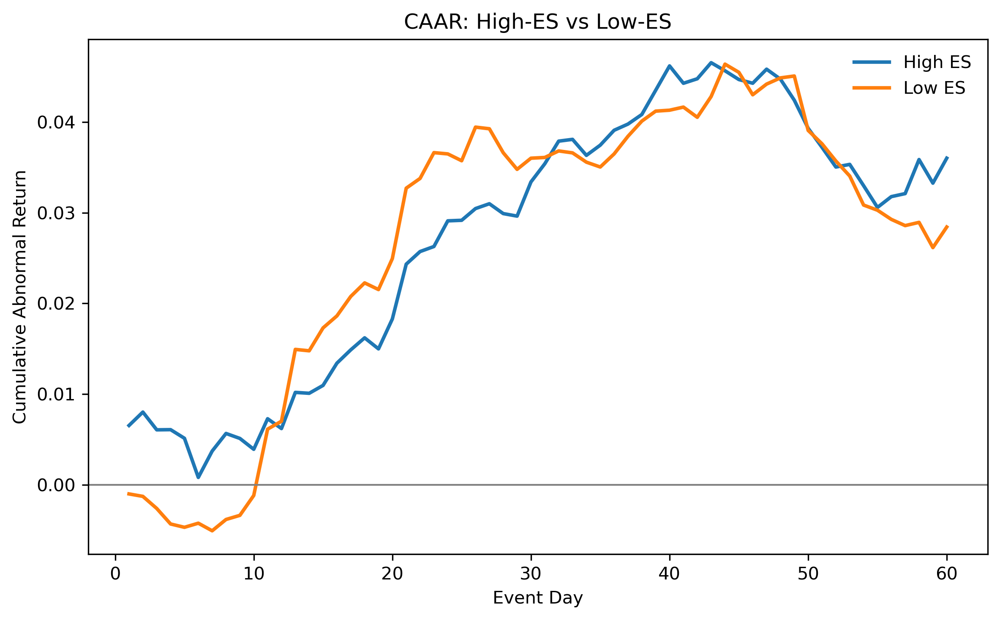

# 中国A股盈利意外、估值调整与市场有效性研究 | Earnings Surprise, Valuation, and Market Efficiency (China A-share)

<p align="center">
  <a href="#zh"></a>
  <a href="#en"></a>
</p>

<a id="zh"></a>

## 简体中文

当前语言：中文 | [Switch to English](#en)

## 项目概述

本仓库已经从“弱代理 guidance 事件研究”收缩为一个以 **Tushare Pro 为主数据源** 的盈利意外诊断框架。当前版本的重点不是强行给出强 headline，而是把卖方预期、管理层预告、业绩快报、正式披露和市场控制变量放进同一条可审计流程中，展示**预期测量方式与匹配质量如何改变推断结果**。

## 当前默认口径

当前默认 headline 样本不再是 pooled all-event standardized spec，而是更窄、更可解释的 Tushare-first 诊断基线：

- headline 样本：`preannouncement_only`
- headline 匹配层级：`strict_same_quarter`
- headline 预期层级：`tier_1_tushare_report_rc`
- headline 展示窗口：默认先看 `CAR3`、`CAR5`、`CAR10`、`CAR20`，其中重点看 `CAR10`
- headline 信号比较：`raw`、`pct`、`std` 并行比较
- `std` 角色：robustness，不再自动充当唯一主信号
- supplementary 输出：`revision` / `express` / `formal_release` 以及 `all_event_types`
- free-data augmentation：仅作为诊断扩展层，提供 `tier_2_eastmoney_profit_forecast` 和 `tier_3_eastmoney_research_report_text` 的 coverage-vs-quality 对照，不替代 baseline

当前更合适的 repo 叙述是：

> 这是一个 Tushare-based diagnostic baseline，用来展示在中国 A 股盈利相关事件研究中，事件口径、surprise 度量、匹配层级和分析师覆盖阈值如何共同影响 inference；当前 Tushare-only 样本不支持强 headline evidence。

<p align="center">
  
</p>

<p align="center"><em>示例图：高盈利意外组与低盈利意外组的累计收益路径，用于展示诊断输出的形式，而不是宣称当前样本已经支持强 headline 结论。</em></p>

## 当前诊断结论

当前仓库不应再表述为“主规格已经支持强短期估值调整证据”。更合适的结论是：

- preannouncement-only 比 pooled all-event sample 更干净，应作为 headline baseline；
- raw / pct / std 必须并行比较，不能只看 `main_surprise_std`；
- strict vs relaxed 匹配层级必须显式输出，不能静默混合；
- 当前最重要的研究贡献是一个可审计的 Tushare 诊断框架，而不是一个已经被强证据支持的主结论。

## Tushare-first 模块映射

### 1. 卖方预期模块
来源：`report_rc`

核心字段：
- `ts_code`
- `report_date`
- `report_title`
- `report_type`
- `classify`
- `org_name`
- `author_name`
- `quarter`
- `np`
- `eps`
- `pe`
- `rating`
- `max_price`
- `min_price`

功能：
- 构建按股票-报告期-发布日期组织的卖方预期面板
- 支持 `latest_snapshot` / `latest_per_analyst` / `pooled_median`
- 支持最小有效报告数过滤
- 支持从 `report_title` 提取“超预期”辅助标签

### 2. 盈利事件模块
来源：
- `forecast` / `forecast_vip`
- `express` / `express_vip`
- `fina_indicator`

标准化事件类型：
- `preannouncement`
- `revision`
- `express`
- `formal_release`

默认 headline 样本：
- `preannouncement`

supplementary 事件：
- `revision`
- `express`
- `formal_release`

### 3. 市场与控制变量模块
来源：`daily_basic`

核心字段：
- `total_mv`
- `circ_mv`
- `turnover_rate`
- `turnover_rate_f`
- `pe_ttm`
- `pb`
- `ps_ttm`

功能：
- 控制变量
- 流动性筛选
- 微盘/噪声过滤
- 估值控制

## 当前 surprise 体系

当前版本保留三组 headline-surprise 口径并行比较：

- `main_surprise_raw`
- `main_surprise_pct`
- `main_surprise_std`

以及按事件家族拆分的：

- `forecast_surprise_raw/pct`
- `express_surprise_raw/pct`
- `final_surprise_raw/pct`

解读规则：
- `raw`：如果它仍然是最强存活的 Tushare-only 信号，就作为主展示 spec；
- `pct`：衡量比例 surprise；
- `std`：作为 robustness，而不是默认 headline。

## 预期匹配梯度

当前版本不再把不同质量的 `report_rc` 匹配静默混在一起，而是显式区分：

- `strict_same_quarter`
- `same_fiscal_year_nearest_valid`
- `latest_valid_pre_event`
- `multi_report_median`

其中：
- headline baseline 只使用 `strict_same_quarter` + `tier_1_tushare_report_rc`；
- 其他 tiers 作为 relaxed / supplementary diagnostics 单独输出；
- Eastmoney public expectation proxies 被显式标记为 `tier_2` / `tier_3`，只用于 coverage-vs-quality 诊断；
- 输出会分别给出 coverage、regression、CAR 对照表，而不是静默 fallback。

## Free-data augmentation route

当前仓库新增了一条受控的 Route A：free-data augmentation。

它的目标不是替代 Tushare report\_rc，而是回答一个更窄的问题：

> 在保持 `preannouncement_only`、`strict_same_quarter`、`raw surprise`、`CAR10` 等 baseline 口径不变的前提下，加入弱一些但更容易获取的公开 expectation proxies，是否能提高可用覆盖率，同时不明显削弱 identification？

当前分层如下：

- `tier_1_tushare_report_rc`：默认 headline baseline
- `tier_2_eastmoney_profit_forecast`：聚合型公开预期 proxy
- `tier_3_eastmoney_research_report_text`：文本型公开研报 proxy

当前新增的诊断输出包括：

- `outputs/audit/coverage_by_expectation_tier_tushare_first.csv`
- `outputs/audit/coverage_by_event_tier_tushare_first.csv`
- `outputs/audit/coverage_by_tier_stack_tushare_first.csv`
- `outputs/audit/usable_sample_counts_by_tier_year_tushare_first.csv`
- `outputs/tables/regression_results_by_expectation_tier_tushare_first.csv`
- `outputs/audit/augmentation_vs_baseline_note_tushare_first.csv`
- `outputs/audit/free_data_limitations_note_tushare_first.csv`

解释原则：
- 如果 free augmentation 只是增加 coverage 但明显削弱识别质量，就不能作为 headline 替代；
- 如果 free augmentation 在窄样本上增加了可用观测且没有明显破坏 inference，它才有资格作为 diagnostic extension 被展示。

## 事件研究与回归设计

### 事件研究
- 异常收益定义：`AR = stock_return - market_return`
- 核心窗口：`CAR3`、`CAR5`、`CAR10`、`CAR20`
- 额外窗口：`CAR60` 仅保留为 supplementary availability 信息

### headline 回归的当前口径
对 preannouncement-only 且 strict-same-quarter 样本，平行运行：

- `CAR_w ~ main_surprise_raw + controls + FE`
- `CAR_w ~ main_surprise_pct + controls + FE`
- `CAR_w ~ main_surprise_std + controls + FE`

控制与固定效应：
- `log_total_mv`
- `beta`
- `book_to_market`
- `turnover20`
- `pe_ttm`
- `ps_ttm`
- Industry FE
- YearQuarter FE
- EventType FE

标准误：
- 按公司 `ts_code` 聚类

## focused diagnostic package

当前 repo 的重点输出是 side-by-side diagnostic package：

- `preannouncement_only` vs `all_event_types`
- `raw` vs `pct` vs `std`
- `CAR3` / `CAR5` / `CAR10` / `CAR20`
- `strict` vs `relaxed` matching tiers
- 显式的四层 match-quality tiers
- minimum analyst coverage thresholds

关键产物包括：
- `outputs/tables/headline_signal_comparison_tushare_first.csv`
- `outputs/tables/diagnostic_compare_event_universe_tushare_first.csv`
- `outputs/tables/diagnostic_compare_signal_scale_tushare_first.csv`
- `outputs/tables/diagnostic_compare_car_window_tushare_first.csv`
- `outputs/tables/diagnostic_compare_match_tier_tushare_first.csv`
- `outputs/tables/diagnostic_compare_strict_relaxed_tushare_first.csv`
- `outputs/tables/diagnostic_compare_analyst_threshold_tushare_first.csv`
- `outputs/audit/coverage_by_match_tier_tushare_first.csv`

## 当前结论口径

当前更合适的 headline 不是：
- 强 PEAD 已成立
- pooled all-event standardized spec 可以直接作为主结论
- 所有事件类型都应该合并解释

更合适的表述是：

> 在更严格的 Tushare-first 设计下，preannouncement-only 样本提供了一个更干净的短窗盈利意外诊断基线；但 inference 会随着 surprise 度量、匹配层级与分析师覆盖阈值明显变化，因此当前仓库更适合作为 Tushare-based diagnostic baseline，而不是强 headline evidence。

## 目录结构

### 原始数据
- `data_raw/`
- `data_raw/tushare/stock_basic/`
- `data_raw/tushare/report_rc/`
- `data_raw/tushare/forecast/`
- `data_raw/tushare/express/`
- `data_raw/tushare/fina_indicator/`
- `data_raw/tushare/daily_basic/`

### 中间结果
- `data_processed/normalized/`
- `data_processed/expectations/`
- `data_processed/events/`
- `data_processed/panels/`

### 最终输出
- `outputs/tables/`
- `outputs/figures/`
- `outputs/audit/`

## 关键代码文件

- `main.py`
- `src/pipeline.py`
- `src/config.py`
- `src/data_collection.py`
- `src/tushare_normalization.py`
- `src/expectation_alignment.py`
- `src/tushare_event_design.py`
- `src/panel_outputs.py`
- `src/guidance_design.py`（legacy fallback）

## 运行方式

### 1. 安装依赖

```bash
pip install -r requirements.txt
```

### 2. 设置 Tushare Token

```bash
export TUSHARE_TOKEN="your_token_here"
```

Windows Git Bash 同样可使用上述写法。不要把 token 写入仓库文件。

### 3. 运行推荐测试规格

```bash
RUN_MODE=test \
FRAMEWORK_MODE=tushare_first \
SAMPLE_STOCK_COUNT_TEST=120 \
USE_CACHE=1 \
REQUEST_PAUSE_SEC=0.12 \
python main.py
```

## 备注

- `forecast_vip`、`express_vip` 和 `report_rc` 的可用性取决于当前 Tushare 账户权限。
- 旧 guidance-only 路径保留用于可重复性与对照，不再作为默认 headline。
- 当前仓库的主价值在于可审计的 Tushare 诊断基线，以及展示 expectation measurement / match quality / coverage threshold 对 inference 的影响。

---

<a id="en"></a>

## English

Current language: English | [切换到中文](#zh)

## Project Overview

This repository has narrowed from a weak guidance-only event-study design into a **Tushare Pro-first diagnostic baseline** for earnings-surprise research in China A-shares. The current objective is not to force a strong headline claim, but to place sell-side expectations, management preannouncements, earnings express releases, formal disclosures, and market controls inside one auditable pipeline and show **how expectation measurement and match quality change inference**.

## Current default framing

The default headline is no longer the pooled all-event standardized specification. The cleaner baseline is now:

- headline sample: `preannouncement_only`
- headline match tier: `strict_same_quarter`
- headline event windows: `CAR3`, `CAR5`, `CAR10`, `CAR20`
- headline signal comparison: `raw`, `pct`, and `std` in parallel
- role of `std`: robustness, not the only headline lens
- supplementary outputs: `revision`, `express`, `formal_release`, and `all_event_types`

The right repository framing is now:

> a Tushare-based diagnostic baseline showing how event definition, surprise scaling, matching tier, and analyst coverage thresholds affect inference in China A-share earnings-event research, rather than a repository claiming strong Tushare-only headline evidence.

<p align="center">
  
</p>

<p align="center"><em>Example figure: cumulative returns for high-versus-low earnings-surprise groups. This is shown as a diagnostic output example, not as a claim of strong final headline evidence.</em></p>

## Current diagnostic conclusion

The repository should no longer be described as if the pooled standardized main specification already supports a strong short-run valuation-adjustment claim. The more defensible interpretation is:

- preannouncement-only is the cleaner headline baseline;
- raw / pct / std must be compared in parallel rather than centering only `main_surprise_std`;
- strict and relaxed expectation tiers must be shown explicitly rather than mixed silently;
- the main contribution is an auditable Tushare diagnostic framework, not a strongly supported final headline.

## Tushare-first module mapping

### 1. Sell-side expectation module
Source: `report_rc`

Functions:
- build a stock-period-date sell-side expectation panel
- support `latest_snapshot`, `latest_per_analyst`, and `pooled_median`
- enforce minimum report-count filters
- extract supplementary over-expectation labels from report titles

### 2. Earnings-event module
Sources:
- `forecast` / `forecast_vip`
- `express` / `express_vip`
- `fina_indicator`

Standardized event types:
- `preannouncement`
- `revision`
- `express`
- `formal_release`

Headline sample:
- `preannouncement`

Supplementary event families:
- `revision`
- `express`
- `formal_release`

### 3. Market/control module
Source: `daily_basic`

Controls include:
- `total_mv`
- `circ_mv`
- `turnover_rate`
- `turnover_rate_f`
- `pe_ttm`
- `pb`
- `ps_ttm`

## Surprise system

The revised framework treats three headline signal scales as parallel diagnostics:

- `main_surprise_raw`
- `main_surprise_pct`
- `main_surprise_std`

with event-family surprise components retained as well.

Interpretation rule:
- `raw` becomes the main display specification if it remains the strongest surviving Tushare-only signal;
- `pct` is the proportional surprise lens;
- `std` is a robustness lens rather than the default headline.

## Expectation-matching ladder

The current design makes match quality explicit instead of silently blending looser matches:

- `strict_same_quarter`
- `same_fiscal_year_nearest_valid`
- `latest_valid_pre_event`
- `multi_report_median`

Interpretation rule:
- the headline baseline uses `strict_same_quarter` only;
- other tiers are supplementary and are reported separately in coverage, regression, and CAR comparison tables.

## Event-study and regression design

### Event study
- abnormal return: `AR = stock_return - market_return`
- main windows: `CAR3`, `CAR5`, `CAR10`, `CAR20`
- `CAR60` remains supplementary only

### Headline regression framing
For the preannouncement-only strict-match sample, the repository now runs parallel headline comparisons:

- `CAR_w ~ main_surprise_raw + controls + FE`
- `CAR_w ~ main_surprise_pct + controls + FE`
- `CAR_w ~ main_surprise_std + controls + FE`

with firm controls, industry fixed effects, year-quarter fixed effects, event-type fixed effects, and firm-clustered standard errors.

## Focused diagnostic package

The key deliverable is a side-by-side package covering:

- `preannouncement_only` vs `all_event_types`
- `raw` vs `pct` vs `std`
- `CAR3` / `CAR5` / `CAR10` / `CAR20`
- strict vs relaxed matching tiers
- the explicit four-tier matching ladder
- analyst coverage thresholds

Core outputs include:
- `outputs/tables/headline_signal_comparison_tushare_first.csv`
- `outputs/tables/diagnostic_compare_event_universe_tushare_first.csv`
- `outputs/tables/diagnostic_compare_signal_scale_tushare_first.csv`
- `outputs/tables/diagnostic_compare_car_window_tushare_first.csv`
- `outputs/tables/diagnostic_compare_match_tier_tushare_first.csv`
- `outputs/tables/diagnostic_compare_strict_relaxed_tushare_first.csv`
- `outputs/tables/diagnostic_compare_analyst_threshold_tushare_first.csv`
- `outputs/audit/coverage_by_match_tier_tushare_first.csv`

## Current conclusion language

The wrong headline would be:
- strong PEAD already established;
- pooled all-event standardized surprise is the default main result;
- all event types should be interpreted together.

The better wording is:

> Under a stricter Tushare-first design, the preannouncement-only sample provides a cleaner short-window earnings-surprise diagnostic baseline, but inference still changes materially with surprise scaling, matching tier, and analyst coverage thresholds. The repository is therefore better understood as a Tushare-based diagnostic baseline than as strong headline evidence.

## Notes

- endpoint availability still depends on the current Tushare account.
- the old guidance-only path remains for reproducibility and comparison, not as the default headline.
- the main value of the current repository is its auditable Tushare baseline and its explicit demonstration that expectation measurement and match quality affect inference.
